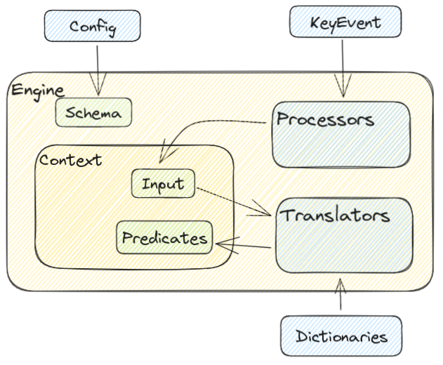

For developers
===

While `afrim is mainly used as a binary application, you can also import the core library directly and use that to build your own input method. In this chapter, we will talk about how to customize the internal working of afrim. Afrim supports [Rhai scripting language](https://rhai.rs) for some customization.

The **For Developers** chapters are here to show you the more advanced usage of `afrim`.

The two main ways a developer can hook into the afrim working is via,
- [Processor](./processor.md)
- [Translator](./translator.md)
- [Frontend](./frontend.md)

Afrim Brief Architecture
---

Afrim Working
---
The working of afrim goes through several steps.

1. Listening keyboard events
    - Identify the event
    - Identify the operation to perform
2. For each translator:
    1. Perform the translation
    2. Return the predicates
3. Display useful information through the frontend interface

